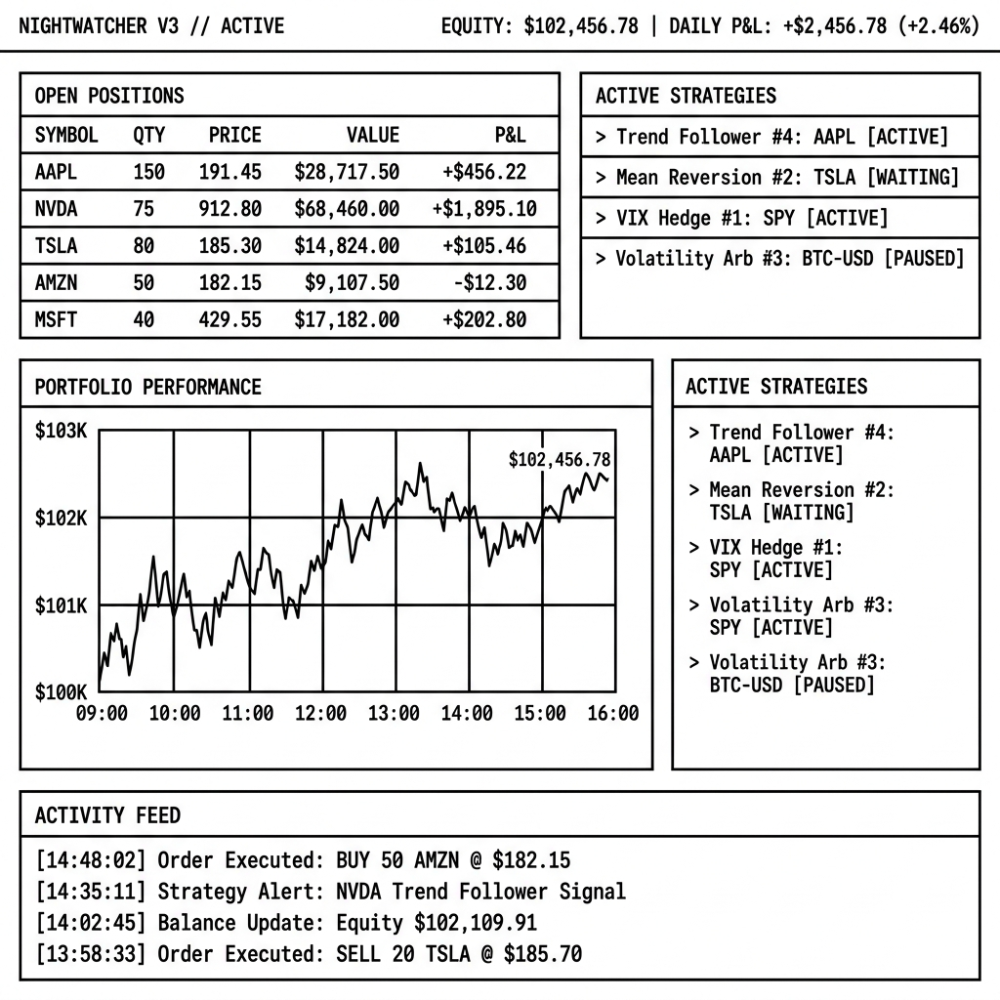
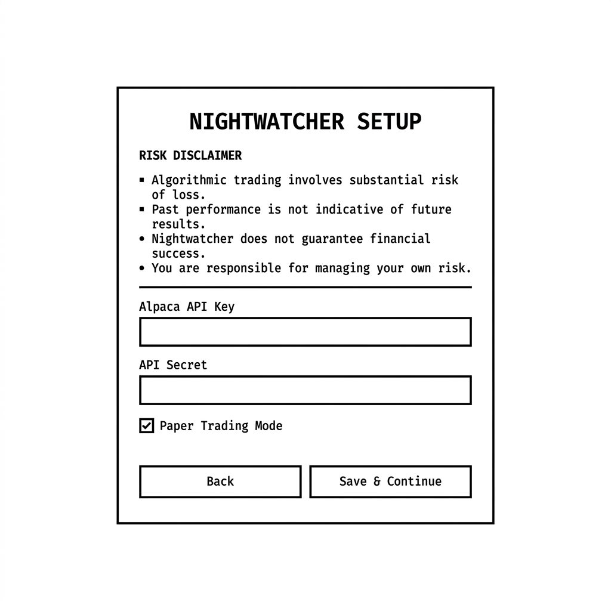

# ░▒▓ NIGHTWATCHER // 

*A self-hosted, policy-gated quantitative rail. Built with absolute intent. Designed for total data sovereignty.*

```
 ╔═══════════════════════════════════════════════════════════════════╗
 ║  [SYSTEM // ACTIVE]                                               ║
 ║  → 7 Quant Strategies   → Pre-Trade Policy Gate (14 Constraints)  ║
 ║  → D1 Local Ledger      → Interactive Tenancy Onboarding Wizard   ║
 ╔═══════════════════════════════════════════════════════════════════╝
```

<p align="center">
  
</p>

---

## ✦ 01 // THE ESSENCE OF NIGHTWATCHER

At its core, NightWatcher is a study in reduction. We wanted to design a quantitative trading infrastructure that strips away the arbitrary complexity of traditional family office setups. What remains is a singular, unified platform that runs specialized LLM-powered agents and deterministic algorithmic runners with absolute precision. 

It is designed to sit quietly at the edge of your local architecture. It does not compromise. It debates risk, analyzes equities, and routes execution orders to Alpaca—all while preserving your data sovereignty. Every detail, from the high-contrast brutalist layout to the monospace-driven typography, has been engineered to feel deliberate and profoundly functional.

---

## ✦ 02 // EFFORTLESS PROVISIONING

We’ve always believed that the transition from initial setup to active execution should be entirely seamless. We wanted to eliminate the friction of provisioning databases, configuring host systems, or manually writing environment files. 

By executing a single command, you initiate a fully automated deployment sequence:

```bash
# Clone the repository to your local architecture
git clone https://github.com/LNSTT369/NightWatcher.git
cd NightWatcher

# Invoke the universal starter script
./start.sh
```

### The Automatic Orchestration
When you run this script, three distinct phases occur in perfect coordination:
1. **Dependency Resolution:** The environment automatically resolves and installs all required packages for both the backend engine and the visual dashboard.
2. **Database Purity:** The local D1 SQLite database is instantly provisioned and seeded, applying migrations `0001` through `0012` without requiring user intervention.
3. **Concurrent Execution:** The Model Context Protocol (MCP) server, the API gateway, the React-based visual dashboard, and all strategy runners begin running simultaneously in a single, coordinated loop.

### Onboarding & Local Isolation
Once the startup sequence completes, point your browser to `http://localhost:3000`. You will be welcomed by a clean, local Setup Wizard. Here, you define your Alpaca API credentials. They are immediately encrypted using AES-GCM (powered by your local `KILL_SWITCH_SECRET`) and committed directly to your local database. Your keys and trade data remain entirely yours, residing solely on your device.

<p align="center">
  
</p>

---

## ✦ 03 // THE INTEGRITY OF EXECUTION

Every signal routed through NightWatcher is subjected to a rigorous, dual-stage verification process. We designed this constraint system to serve as an uncompromising shield against market anomaly and technical failure.

```
     [Signal Source] (REST / WebSocket / MCP Agent)
            │
            ▼
┌──────────────────────────────────────┐
│  orders-preview (14 Policy Checks)   │
│  - Cooldown validation               │
│  - Kelly criterion position sizing   │
│  - Daily loss limit clamping         │
└──────────────────┬───────────────────┘
                   │  (Generates HMAC-signed approval token, 5-min TTL)
                   ▼
┌──────────────────────────────────────┐
│  orders-submit (Verifies signature)  │
│  - Re-evaluates platform kill-switch │
│  - Submits trade directly to Alpaca  │
└──────────────────────────────────────┘
```

1. **The Policy Gate (`orders-preview`):** A rigid filter of 14 specific rules evaluates every order request. It enforces cooling-down windows, dynamic Kelly criterion sizing, and absolute daily loss limits. When passed, it signs the order with a cryptographic HMAC token having a strict 5-minute lifespan.
2. **The Execution Gate (`orders-submit`):** The submission endpoint verifies this cryptographic signature, double-checks the global system kill-switch status, and sends the order to Alpaca. This structure ensures no rogue agent or script can issue unauthorized trades.

---

## ✦ 04 // THE STRATEGY MATRIX

NightWatcher orchestrates seven isolated strategy loops, each configured to run in absolute isolation and target specific market behaviors:

| Strategy | Algorithmic Mechanism | Session Window | Risk Exit Rule |
| :--- | :--- | :--- | :--- |
| **ORB** | Opening Range Breakout | First 15–60 min of RTH | Opposite range side / fixed profit target |
| **Momentum Breakout** | Volume-confirmed breakouts | Intraday (Morning session) | ADR% deviation trailing stop |
| **Gap and Go** | Pre-market overnight gap capture | Market Open (First 30 min) | Forced close-of-session market exit |
| **Mean Reversion** | Extended deviation from VWAP | Continuous | Return to VWAP mean / tight stop loss |
| **Options Momentum** | Leveraged call/put legs | Continuous | Delta-based trailing stop |
| **VWAP Reversion** | Volume-weighted average reversion | Continuous | Overbought/oversold Bollinger exit |
| **VP-MACD** | Volume-profile MACD divergence | Continuous | MACD histogram shift + volume check |

---

## ✦ 05 // SYSTEM ARCHITECTURE

The technical choices behind NightWatcher reflect our obsession with efficiency, local latency, and extreme utility.

* **Runtime Environment:** Cloudflare Workers, Durable Objects, and Node.js working in harmony.
* **Storage Layer:** local D1 SQLite database acts as a persistent ledger, paired with KV Namespace for low-latency state retrieval.
* **Access Protocols:**
  * **REST Gateway:** `POST /api/signal` for standard signal ingestion.
  * **WebSocket Channels:** `/stream` for real-time telemetry.
  * **Model Context Protocol (MCP):** Exposes execution and risk tools natively to LLM assistants (Claude, Cursor, etc.).
* **Security Layer:** Absolute cryptographic isolation using AES-256-GCM and HMAC-signed execution tokens.

---

## ✦ 06 // ANATOMY OF THE DIRECTORY

The layout of the codebase is highly structured, mapping directly to its execution logic:

```
NIGHTWATCHER/
├── src/                          # The core engine source
│    ├── api/                     # Setup API and signal gateways
│    ├── mcp/                     # Model Context Protocol declarations
│    ├── policy/                  # Pre-trade policy constraints
│    └── durable-objects/         # Stateful session control
├── dashboard/                    # React frontend application
├── migrations/                   # Local database schema versions
├── strategies/                   # Isolated algorithmic strategy files
├── scripts/                      # Production API & execution tools
└── _archive/                     # Archived materials
```

---

## ✦ 07 // A MANDATORY CLARITY (DISCLAIMER)

This system is an exploration of quantitative technology, provided strictly for educational and informational purposes. No part of this repository represents financial, investment, legal, or tax advice. All trading decisions involve significant risk and are yours alone. Markets are volatile; you should only trade with capital you can afford to lose. We strongly advocate for testing via Paper Trading environments before deploying live capital.

---
<sup>Licensed under the MIT License. Built with a commitment to privacy, performance, and self-sovereign code.</sup>
