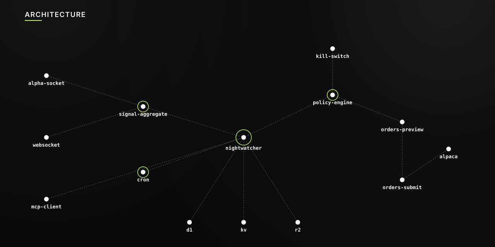

<div align="center">
  <picture>
    
  </picture>
</div>

<br>

<div align="center">

# NIGHTWATCHER V3

**Universal execution layer for autonomous trading.**<br>
Any strategy · Any language · One signal call.

<br>

`TypeScript` &nbsp;·&nbsp; `Cloudflare Workers` &nbsp;·&nbsp; `Durable Object` &nbsp;·&nbsp; `MCP` &nbsp;·&nbsp; `Alpaca`

</div>

---

## INTERFACES

Three ways to route a signal into the execution layer.

| Interface | Endpoint | Best For |
|---|---|---|
| REST | `POST /api/signal` | Scripts, services, webhooks — one HTTP call, no MCP client |
| WebSocket | `/stream` | Streaming sources, high-frequency signal feeds |
| MCP | `signal-submit` | LLM agents with access to the full ~50-tool interface |

Authentication for REST and WebSocket is optional. Set `SIGNAL_API_KEY` to require a Bearer token.

---

## EXECUTION FLOW

Every trade follows a mandatory two-step path enforced in code. No token, no execution.

```
orders-preview
  └─ validates against PolicyEngine (14 checks)
  └─ generates HMAC-signed approval token (5-min TTL → D1)
  └─ returns token on pass, error with reason on fail

orders-submit
  └─ verifies token (not expired · not used)
  └─ re-checks kill switch
  └─ calls Alpaca API
  └─ records trade in D1
```

**Submit a signal via REST:**

```bash
curl -X POST http://localhost:8787/api/signal \
  -H "Content-Type: application/json" \
  -d '{
    "source": "external",
    "symbol": "AAPL",
    "direction": "long",
    "confidence": 0.80,
    "urgency": "session",
    "horizon": 60,
    "rationale": "Breakout above VWAP with volume confirmation"
  }'
```

---

## QUICK START

**1. Clone and install**

```bash
git clone https://github.com/ygwyg/NIGHTWATCHER.git
cd "NIGHTWATCHER V2"
npm install
```

**2. Configure secrets**

```bash
cp .env.example .dev.vars
```

```bash
# .dev.vars — required
ALPACA_API_KEY=your_key
ALPACA_API_SECRET=your_secret
ALPACA_PAPER=true
KILL_SWITCH_SECRET=any_random_string

# optional
OPENAI_API_KEY=sk-...       # enables LLM tools
SIGNAL_API_KEY=...          # adds auth to /api/signal and /stream
```

**3. Provision Cloudflare resources**

```bash
wrangler d1 create nightwatcher-db
wrangler kv:namespace create CACHE
# paste the returned IDs into wrangler.toml
```

**4. Migrate and run**

```bash
npm run db:migrate
npm run dev              # http://localhost:8787
```

---

## POLICY ENGINE

14 checks run on every `orders-preview` call. Any failure returns a structured error — no token is issued.

| Check | Default |
|---|---|
| Kill switch | blocks immediately if active |
| Loss cooldown | 30 min pause after any realized loss |
| Daily loss limit | 2% of account equity |
| Market hours | NYSE regular session only |
| Symbol allow / deny list | configurable |
| Order type restrictions | configurable |
| Notional cap per trade | $2,000 |
| Position size % of equity | 10% |
| Max open positions | 5 |
| Short-selling | disabled |
| Buying power | real-time Alpaca check |
| Options DTE | ≥ 7 days |
| Options delta | configurable range |
| Options exposure | max % of equity |

Override any default via D1 (persisted across restarts) or `wrangler.toml [vars]` (boot-time defaults).

---

## STORAGE

| Layer | Binding | Contents |
|---|---|---|
| D1 | `DB` | trades · approvals · alpha\_signals · policy config · risk state · journal · tool logs |
| KV | `CACHE` | hot reads · market state · counterparty signal weights |
| R2 | `ARTIFACTS` | research reports · backtest results · large payloads |

---

## CRON

| Schedule | Job |
|---|---|
| `*/5 13-20 * * 1-5` | SEC EDGAR event ingestion (market hours) |
| `0 14 * * 1-5` | Market open prep · cleanup expired approvals |
| `30 21 * * 1-5` | Market close cleanup |
| `0 5 * * *` | Midnight reset — daily loss counter |
| `0 * * * *` | Hourly cache refresh |

---

## CONFIGURATION

| Variable | Default | Description |
|---|---|---|
| `DEFAULT_MAX_POSITION_PCT` | `0.10` | Max position as % of equity |
| `DEFAULT_MAX_NOTIONAL_PER_TRADE` | `2000` | Hard notional cap per order ($) |
| `DEFAULT_MAX_DAILY_LOSS_PCT` | `0.02` | Daily loss limit |
| `DEFAULT_COOLDOWN_MINUTES` | `30` | Cooldown after a loss |
| `DEFAULT_MAX_OPEN_POSITIONS` | `5` | Max concurrent open positions |
| `DEFAULT_APPROVAL_TTL_SECONDS` | `300` | Approval token lifetime |
| `ALPACA_PAPER` | `true` | Paper trading mode — set `false` for live |
| `LLM_PROVIDER` | — | `openai` · `gemini` · `ollama` |
| `FEATURE_LLM_RESEARCH` | `false` | Enable LLM-powered tools |
| `FEATURE_OPTIONS` | `false` | Enable options trading |

---

## PROJECT STRUCTURE

```
src/
├── index.ts                    # Worker entry · route dispatch
├── env.d.ts                    # Cloudflare bindings + secrets
├── api/
│   └── signal.ts               # POST /api/signal · GET /api/signal/:id
├── mcp/
│   └── agent.ts                # NightwatcherMcpAgent · ~50 MCP tools
├── policy/
│   ├── engine.ts               # PolicyEngine · 14 pre-trade checks
│   ├── config.ts               # PolicyConfig + D1 override loader
│   └── approval.ts             # HMAC token generation + verification
├── signals/
│   └── types.ts                # AlphaSignal · AggregatedSignal · SOURCE_WEIGHTS
├── stream/
│   └── handler.ts              # WebSocket /stream handler
├── storage/
│   ├── d1/                     # Per-table D1 query files
│   ├── kv/                     # KV cache helpers
│   └── r2/                     # R2 artifact helpers
├── providers/
│   ├── alpaca/                 # Alpaca REST + streaming client
│   └── llm/                    # OpenAI · Gemini · Ollama adapters
└── jobs/
    └── cron.ts                 # Scheduled event handlers
```

---

## DISCLAIMER

This software is for **educational and informational purposes only.** Nothing in this repository constitutes financial, investment, legal, or tax advice. All trading decisions are made at your own risk. Markets are volatile — you can lose some or all of your capital. The authors are not responsible for any financial losses resulting from use of this software. Always start with `ALPACA_PAPER=true` and never risk money you cannot afford to lose.

**[Join Discord](https://discord.gg/Ys8KpsW5NN)**

---

<sup>MIT License</sup>
